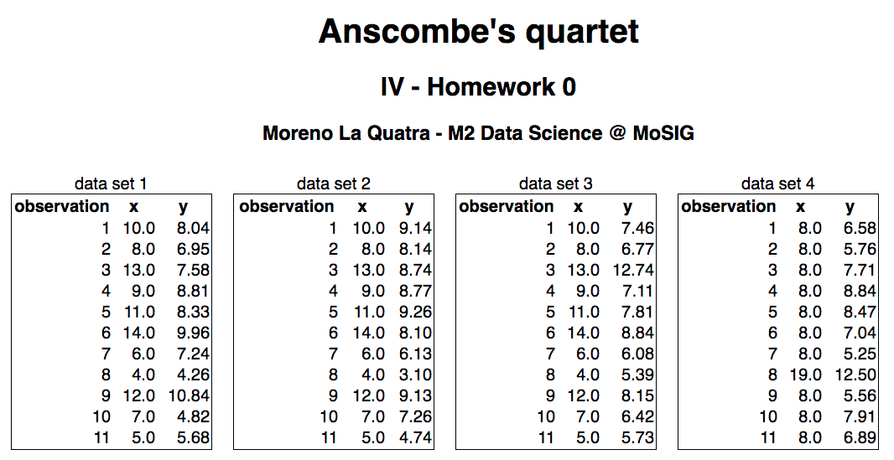
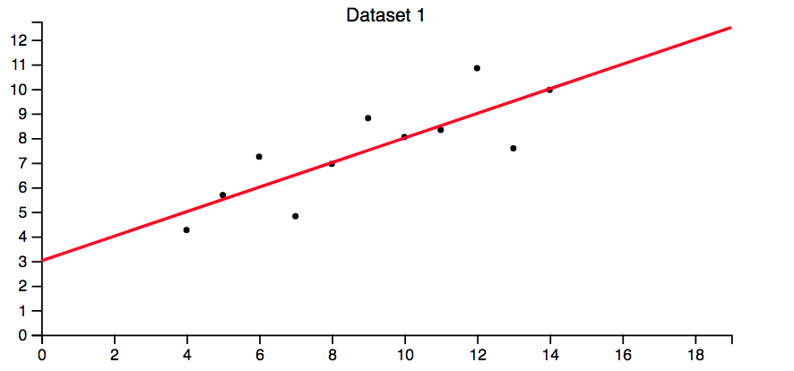
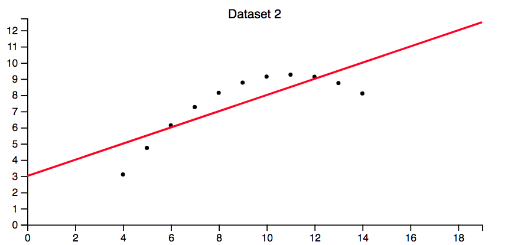
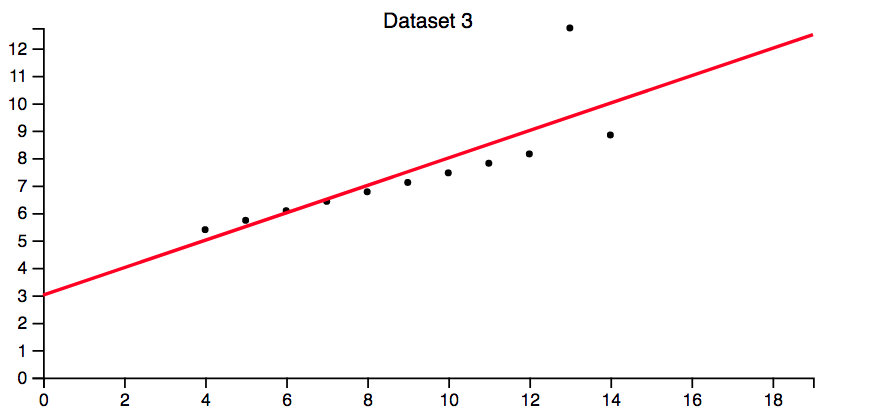
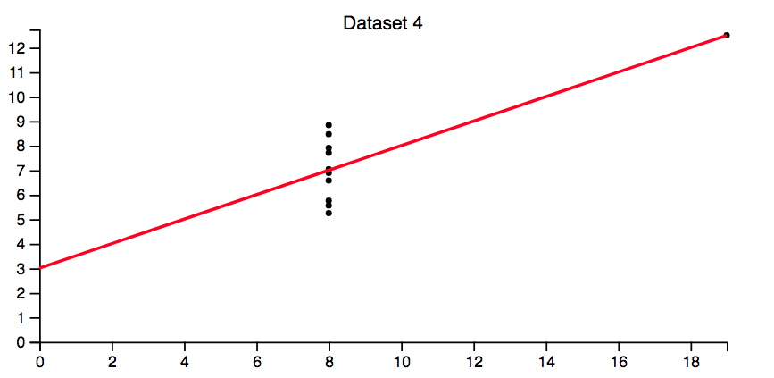

Anscombe's quartet
==================

A dataset scrapped from the famous *Graphs in Statistical Analysis by F. J. Anscombe (1973)*.

Files
-----

- data/anscombe.txt   reproduction of  the original data set
- data/txt2tsv.py     script to generate table from original data set
- data/anscombe.tsv   data set

- viz/0-tables.html   table "visualisation" generated using d3.js

References
-----
- Graphs in Statistical Analysis: http://iihm.imag.fr/blanch/teaching/infovis/readings/1973-Anscombe-Graphs_in_Stats.pdf
- d3.js: http://d3js.org

Information Visualization Course (Grenoble INP - MoSIG)
-----

- Homewoek 0 of Information Visualization course.
- Creator: *Moreno La Quatra*
- Initial Template: provided by the teacher

Screenshot of the project
-----
  
  
  
  
  
